### 绘图系统说明书

该绘图系统包含如下功能：选择绘图算法、绘制线段、绘制多边形、绘制圆/椭圆、绘制曲线、重置画布、保存画布、设置画笔颜色、对图元平移、对图元旋转、对图元缩放、对线段裁剪。

#### 开发环境说明

本系统使用python3.7开发，图形学用户界面程序由python tkinter package支持开发。本系统中使用的package包括：tkinter, numpy, math, scipy, PIL, os, sys, re。本系统中的绘图核心算法在algorithms.py中实现。gui.py中定义了图形界面，cmd.py中则负责读入命令文件并转化成函数调用绘图，Objects.py中定义了一些文件间可共享全局变量。

#### 代码编译说明

本系统使用python脚本语言编写，不需要编译，在source目录下运行`python3  painter.py -[option:cmd/gui] [possible file]` 即可运行。option可以是cmd或者gui，如果选择cmd则在后面附加命令文件地址，如果选择gui即可直接运行。

#### 程序运行说明（图形界面）

##### 选择绘图算法

在control panel面板中的下拉菜单中选择在此次绘制中所希望使用的算法，注意：算法并非对于每个绘制指令都普适，请仔细选择对应算法。

##### 绘制线段

选择希望使用的绘制算法（DDA/Bresenham），单击在control panel面板中的"DrawLine"按钮，而后在画板中点出线段的两个端点，如此就会生成预期线段。

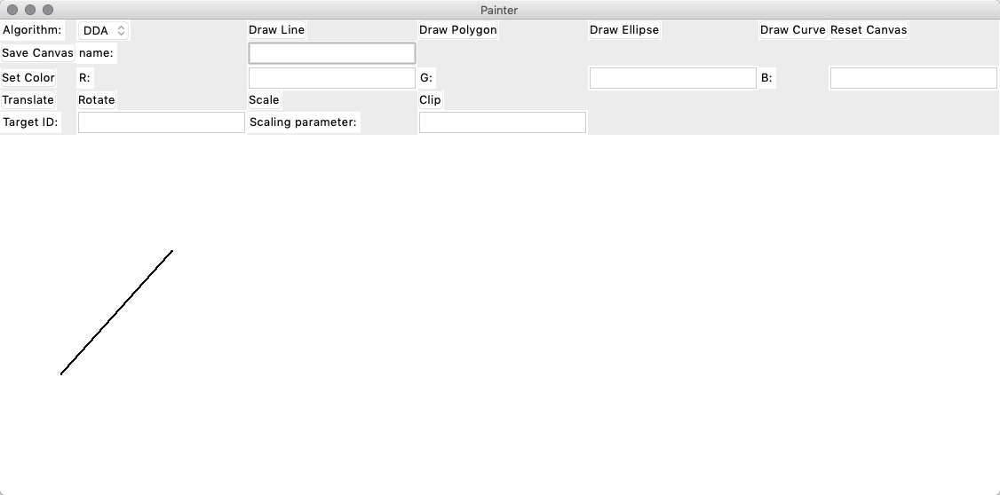

注意：点击按钮和在画板中选点的顺序非常重要。

##### 绘制多边形

选择希望使用的绘制算法（DDA/Bresenham），单击在control panel面板中的"DrawPolygon"按钮，而后在画板中点出该多边形的n个点。由于多边形为闭合图形，所以结束多边形绘制需要将最后一个点选择为起始点，请点击尽量靠近起始点的位置。

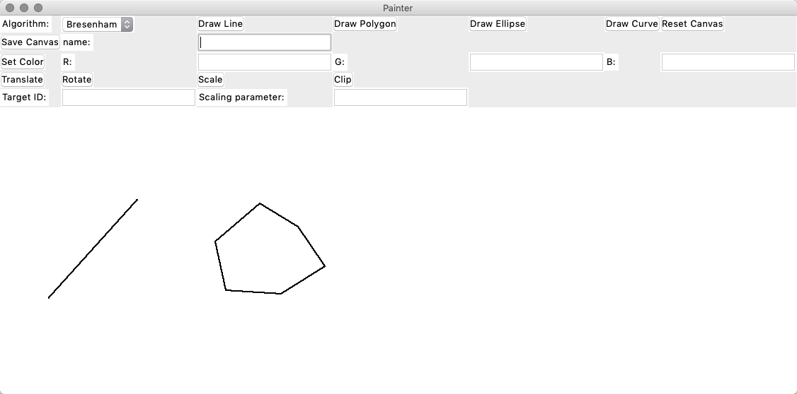

##### 绘制圆/椭圆

选择希望使用的绘制算法（MidPointCircle/Bresenham），先在画板中拖动鼠标选出需要画椭圆的位置，然后单击在control panel面板中的"DrawEllipse"按钮，即可生成椭圆。

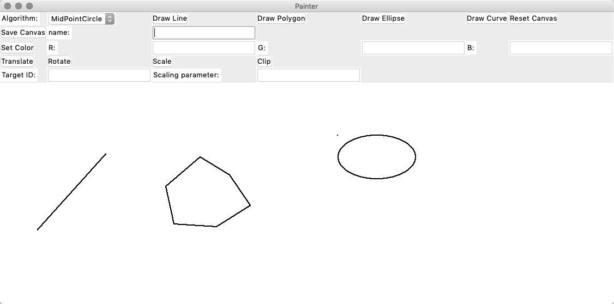

##### 绘制曲线

选择希望使用的绘制算法（Bezier/B-Spline），先在画板中拖动鼠标选出曲线的n个控制点，然后单击在control panel面板中的"DrawCurve"按钮，即可生成曲线。

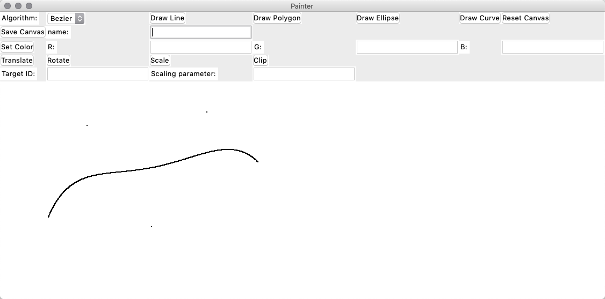

##### 重置画布

直接点击ResetCanvas按钮即可清除画布上图元，但是由于美观要求，gui界面不支持在重置画布时改变画布大小。

##### 保存画布

在输入框中输入保存图片名，再点击Save Canvas按钮就可以将当前画布保存在当前目录下，保存格式为bmp文件。

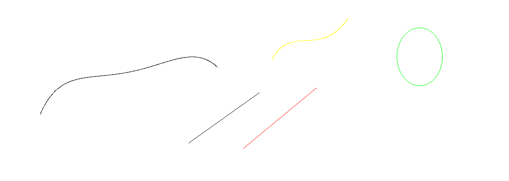

##### 设置画笔颜色

分别在RGB三个输入框中输入0-255之间的值，必须填完三个输入框，然后单击setColor按钮即可改变画笔颜色。

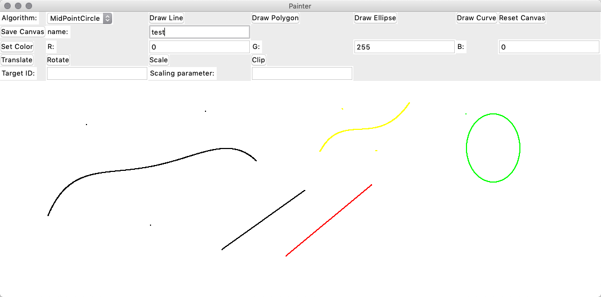

##### 平移图形

先输入图元id，gui界面中的图形id为从0开始的顺序计数。输入图元id后，在画板中拖动鼠标画出平移向量，然后单击translate，就可以平移图形。

下图平移了第0号图元

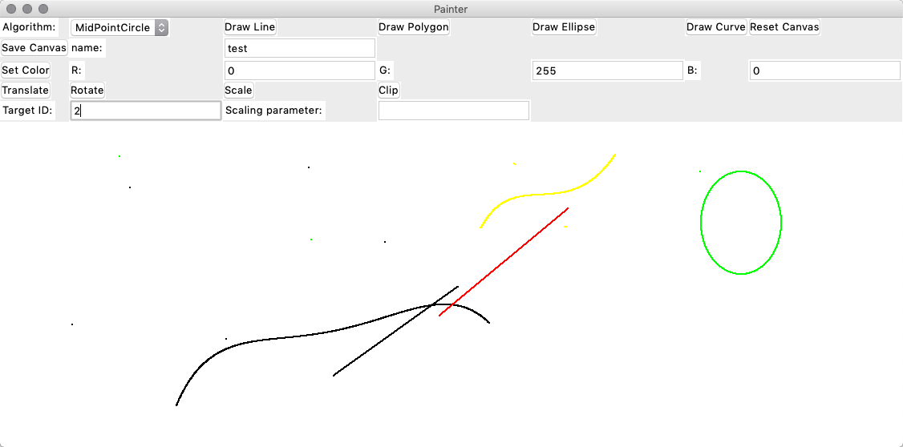

#####旋转图形

先输入图元id，gui界面中的图形id为从0开始的顺序计数。输入图元id后，在画板中拖动鼠标画出旋转弧线，再点出旋转中心（这里顺序很重要）。单击rotate按钮，就可以旋转图形。

下图旋转第0号图元。

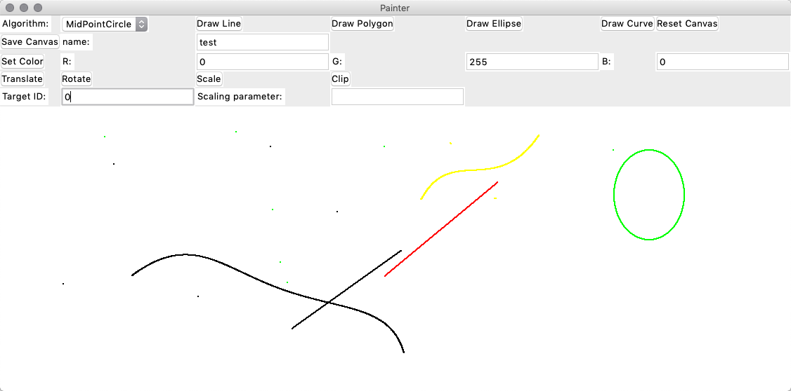

##### 缩放图形

先输入图元id，gui界面中的图形id为从0开始的顺序计数。输入图元id后，在画板中点出缩放中心，再键盘输入缩放参数。单击scale按钮，就可以缩放图形。

下图将0号图元缩放0.5倍，将4号图元缩放2倍。

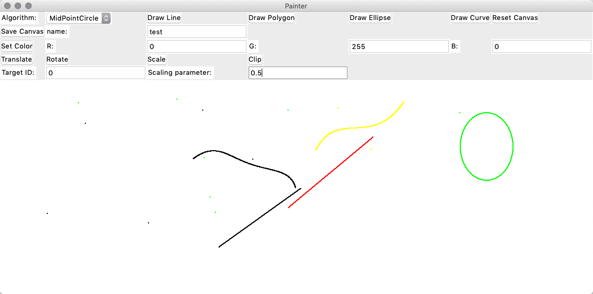

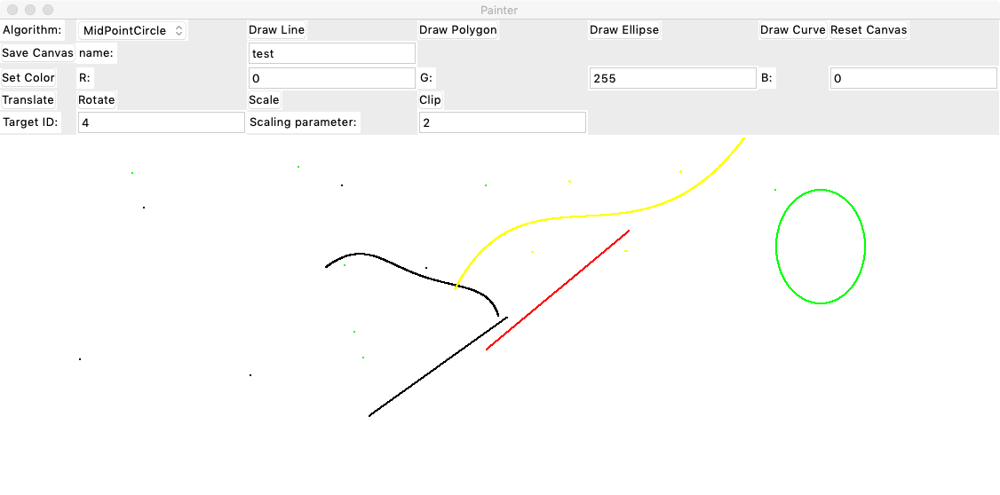

##### 线段裁剪

输入图元id，再选择适合的算法（Cohen–Sutherland/Liang-Barsky），然后单击Clip按钮就可以裁剪线段。

下图用Cohen-Sutherland算法裁剪了图元4。

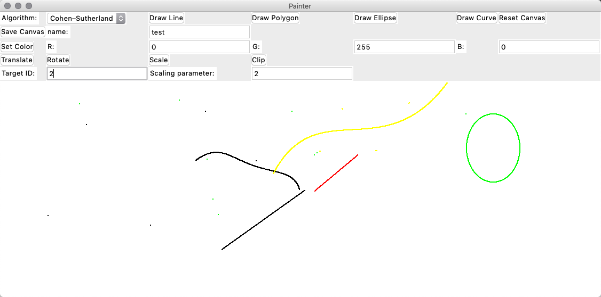

