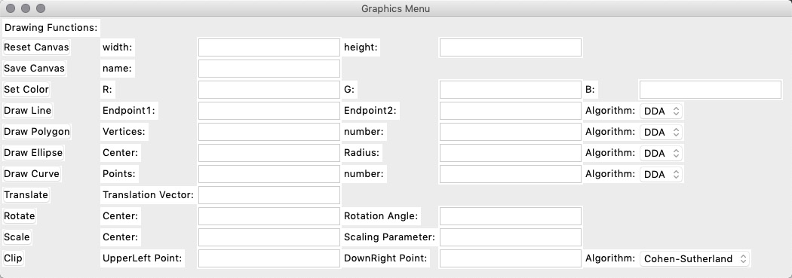

# (Developing!) mySketchpad 
This project is mainly about paint geometry primitives in a canvas. `algorithms.py` will have all the drawing algorithms and `gui.py` along with `cmd.py` provide methods to interact with the 'brush' to draw.
It is developed using python3.6 and tkinter package. 

4/9/2019

Completed code skeleton for `algorithms.py` and simple test for `gui.py`.
Only `gui.py` can be compiled and run for now, and compilation is through command line `python3 gui.py`.

4/14/2019

Finished GUI setup 1st edition, add basic algorithm input error handling with respect to the GUI. GUI can be run with `python3 gui.py`. Current GUI preview:

